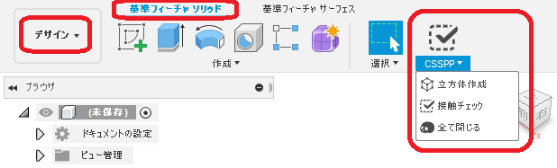

# ***Fusion360 CSSPP***

これは、オートデスクソフトウェア「Fusion360」のアドインです。

閉空間球充填問題(Closed Space Sphere Packing Problem)の取り組みをサポートします。
問題の詳細は[こちら](https://forums.autodesk.com/t5/fusion-360-ri-ben-yu/wen-tidesu/td-p/9225621)をご覧ください。

## インストール:
緑の「Clone or downlode」からダウンロードし解凍。「ClosedSpaceSpherePackingProblem」フォルダをアドインとして指定して下さい。

指定方法は[こちら](https://knowledge.autodesk.com/ja/support/fusion-360/troubleshooting/caas/sfdcarticles/sfdcarticles/JPN/How-to-install-an-ADD-IN-and-Script-in-Fusion-360.html)の手順に従ってください。

## 使用法:

+ アドインを起動しそれぞれのコマンドを実行してください。
「デザイン」-「基準フューチャソリッド」に「CSSPP」のパネルが追加されます。

## コマンド:

### ・"立方体作成"コマンド
ドキュメントを新作し、一辺100で原点を重心とする立方体を作成します。

### ・"接触チェック"コマンド
立方体・球体の接触・干渉をチェックします。実行の際以下の条件が必要です。
※球体は、プリミティブの球・スケッチの半円を回転で作成したものは、チェック可能ですが、フォームの球・クワッドボールでは確認出来ません。
+ 1個の立方体が表示されている
+ 1個以上の球体が表示されている上、全て同一の半径となっている

又、実行後は結果としてスケッチが作成されます。
+ 接触：接点に点が作成されます。
+ 干渉：お互いが干渉している部分に曲線が作成されます。(結果的にNGです)

### ・"全て閉じる"コマンド
現在開かれている全てのドキュメント(ファイル)を **保存せずに** 閉じます。
再度記載しますが、全て **保存せずに** 閉じます。

## アクション:
以下の環境で確認しています。
 + Fusion360 Ver2.0.7046
 + Windows10 64bit Home

### 残された問題:
+ Macでの動作、未確認

### ライセンス:
MIT

### 謝辞:
+ こちらの便利な[フレームワーク](https://github.com/tapnair/Fusion360AddinSkeleton)を試用しました。
 Patrick Rainsberryさん、ありがとう。
+ [日本語フォーラム](https://forums.autodesk.com/t5/fusion-360-ri-ben-yu/bd-p/707)の皆さん、ありがとう。